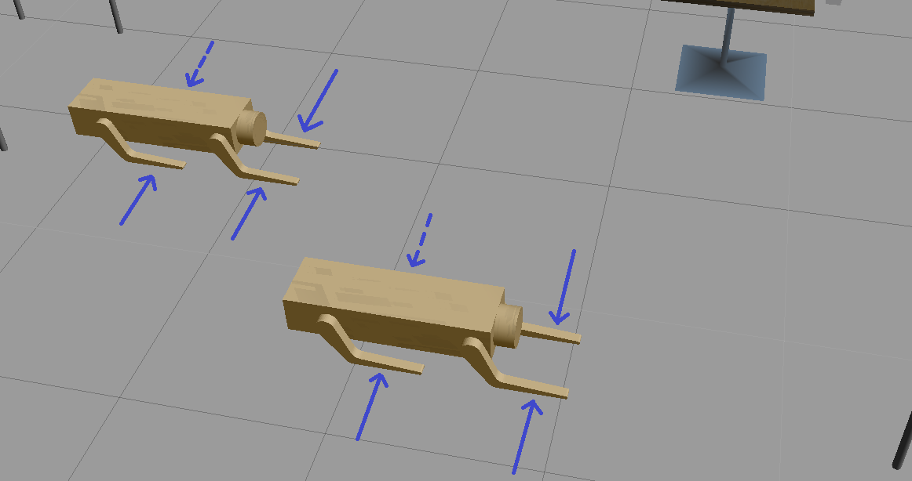

### Robotics Software Engineer - Nanodegree

# Project 03 (of 05) : Where Am I
## Directory Structure
<pre>
.Where_Am_I                                      # Where_Am_I project
   ├── my_robot                                  # my_robot package
   │   ├── CMakeLists.txt                        # compiler instructions
   │   ├── config                                #configuration files for move_base package
   │   │   ├── base_local_planner_params.yaml
   │   │   ├── costmap_common_params.yaml
   │   │   ├── global_costmap_params.yaml
   │   │   ├── local_costmap_params.yaml
   │   ├── launch                                # launch folder for launch files 
   │   │   ├── amcl.launch
   │   │   ├── robot_description.launch
   │   │   └── world.launch
   │   ├── maps
   │   │   ├── my_map.pgm                        # created using ROS package: <a href="https://github.com/udacity/pgm_map_creator" title="pgm_map_creator">pgm_map_creator</a> 
   │   │   └── my_map.yaml                       # metadata about the map
   │   ├── meshes                                # meshes folder for sensors and model
   │   │   ├── hokuyo.dae                        # mesh for laser scanner
   │   │   └── RoboLeg.STL                       # CAD file of Robot's leg (made in SolidWorks)
   │   ├── package.xml                           # package info
   │   ├── urdf                                  # urdf folder for xarco files
   │   │   ├── my_robot.gazebo
   │   │   └── my_robot.xacro
   │   └── worlds                                # world folder for world files
   │       └── Avadhoot.world
   ├── teleop_twist_keyboard                     # ROS package
   │   ├── CHANGELOG.rst
   │   ├── CMakeLists.txt                        # compiler instructions
   │   ├── package.xml                           # package info
   │   ├── README.md
   │   └── teleop_twist_keyboard.py              #python script for controlling robot
   ├── LICENSE
   ├── README.md
   │
   
</pre>

## Project Goals
Creating a ROS package that launches a custom robot model in a custom Gazebo world.

Utilizing the ROS AMCL package and the Tele-Operation / Navigation Stack to localize the robot.

Explore, add, and tune specific parameters corresponding to each package to achieve the best possible localization results

## Output 
Speed: x5 (original speed is the simulation speed which depends on the processing power of the system)

## Environment
Tested on Ubuntu 16.04.6 LTS, ROS Kinetic, Boost 1.58

## Setup and run
Note: The commands in this README work, considering that the main workspace is located at ```/home/robond/workspace/catkin_ws/src```      
      Notice the ```robond``` username. Make appropriate changes for your system.
      
Warning: Some minor features will not work in your system if your username of the system is different.

[Click here for the fix and to learn more](#Missing-minor-feature)
#### 1. Update the Workspace image
```
$ sudo apt-get update && sudo apt-get upgrade -y 
```
### 2. Install supporting packages
```
$ sudo apt-get install ros-kinetic-navigation
$ sudo apt-get install ros-kinetic-map-server
$ sudo apt-get install ros-kinetic-move-base
$ sudo apt-get install ros-kinetic-amcl
```

OR

```
$ sudo apt-get install ros-kinetic-navigation && sudo apt-get install ros-kinetic-map-server && sudo apt-get install ros-kinetic-move-base && sudo apt-get install ros-kinetic-amcl
```
Replace ```kinetic``` with ```YOUR_DISTRO```
#### 3. Clone the files in /home/workspace
```
$ cd /home/robond/workspace/catkin_ws/src
$ git clone https://github.com/Avadhoot94/Where_Am_I.git
```

Optional: If you want to control the robot using keyboard (```teleop``` package)
```
$ cd /home/robond/workspace/catkin_ws/src/Where_Am_I
$ git clone https://github.com/ros-teleop/teleop_twist_keyboard
```
#### 4. Build the package
```
$ cd /home/robond/workspace/catkin_ws
$ catkin_make
$ source devel/setup.bash
````
#### 5. Launch the world and the robot
```
$ roslaunch my_robot world.launch
```
Make sure the ```fixed frame``` in ```RViz``` is ```odom```
       
#### 6. Launch the AMCL package 
```
$ roslaunch my_robot amcl.launch
```
#### 7. Launch the Teleop package (optional)
```
$ rosrun teleop_twist_keyboard teleop_twist_keyboard.py
```
Requires ```teleop``` package ([step 3](#3-clone-the-files-in-homeworkspace))

#### 8. Control the robot
Option 1:
Give navigation goal to the robot in ```RViz``` using ```2D Nav Goal``` button

Option 2:
Control the robot using keyboard by launching the ```teleop``` package ([step 7](#7-Launch-the-Teleop-package-optional))

## Missing minor feature
The ```~/Where_Am_I/my_robot/world/Avadhoot.world``` file uses ```~/Where_Am_I/my_robot/meshes/RoboLeg.STL``` for the legs of the **static** robot model as indicated in the picture below:



<p>&nbsp;</p>

The ```Avadhoot.world``` file thus, contains the directory address of the ```RoboLeg.STL``` as ```/home/robond/workspace/catkin_ws/src/Where_Am_I/my_robot/meshes/RoboLeg.STL```<br/> **Replace all** the addresses appropriately to see the legs. 

Else the package will **run without errors** but without the legs as seen below:


